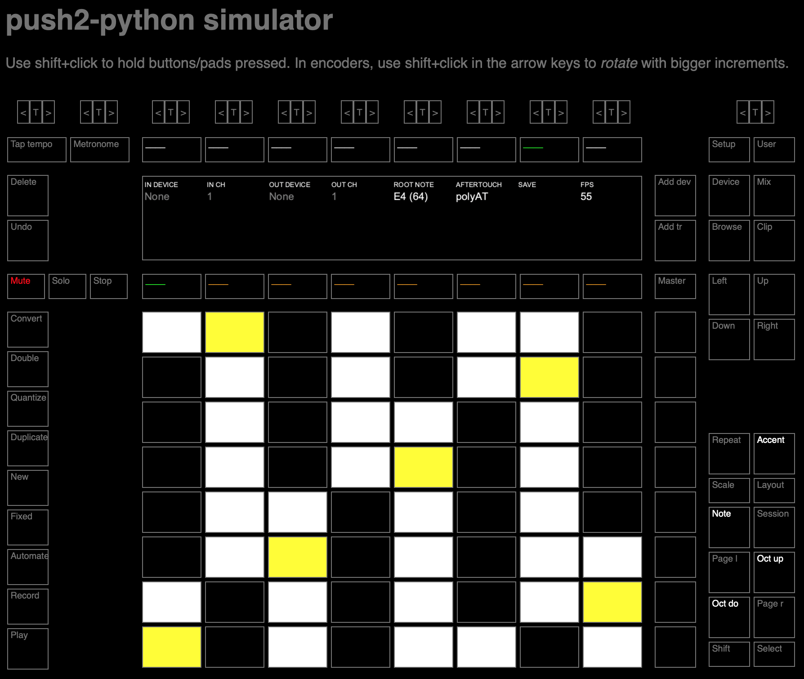

# push2-python

Utils to interface with [Ableton's Push 2](https://www.ableton.com/en/push/) from Python.

These utils follow Ableton's [Push 2 MIDI and Display Interface Manual](https://github.com/Ableton/push-interface/blob/master/doc/AbletonPush2MIDIDisplayInterface.asc) for comunicating with Push 2. I recommend reading Ableton's manual before using this tool.

So far I only implemented some utils to **interface with the display** and some utils for **interaction with pads, buttons, encoders and the touchstrip**. More detailed interaction with each of these elements (e.g. changing color palettes, support for led blinking, advanced touchstrip configuration, etc.) has not been implemented. Contributions are welcome :)
**UPDATE**: customization of color palettes and led animations is now implemented!

I only tested the package in **Python 3** and **macOS**. Some things will not work on Python 2 but it should be easy to port. I don't know how it will work on Windows/Linux. ~~It is possible that MIDI port names (see [push2_python/constants.py](https://github.com/ffont/push2-python/blob/master/push2_python/constants.py#L12-L13)) need to be changed to correctly reach Push2 in Windows/Linux~~. **UPDATE**: MIDI port names should now be cross-platform, but I have not tested them on Linux/Windows.

`push2-python` incorporates a Push2 simulator so you can do development without having your push connected. Check out the [simulator section](#using-the-simulator) below

Code examples are shown at the end of this readme file. For an example of a full application that I built using `push2-python` and that allows you to turn your Push2 into a standalone MIDI controller (using a Rapsberry Pi!), check the [Pysha](https://github.com/ffont/pysha) source source code repository.


## Table of Contents

* [Install](#install)
* [Documentation](#documentation)
    * [Initializing Push](#initializing-push)
    * [Setting action handlers for buttons, encoders, pads and the touchstrip](#setting-action-handlers-for-buttons--encoders--pads-and-the-touchstrip)
    * [Button names, encoder names, pad numbers and coordinates](#button-names--encoder-names--pad-numbers-and-coordinates)
    * [Set pad and button colors](#set-pad-and-button-colors)
    * [Interface with the display](#interface-with-the-display)
    * [Using the simulator](#using-the-simulator)
* [Code examples](#code-examples)
    * [Set up handlers for pads, encoders, buttons and the touchstrip...](#set-up-handlers-for-pads-encoders-buttons-and-the-touchstrip)
    * [Light up buttons and pads](#light-up-buttons-and-pads)
    * [Interface with the display (static content)](#interface-with-the-display-static-content)
    * [Interface with the display (dynamic content)](#interface-with-the-display-dynamic-content)


## Install

You can install using `pip` and pointing at this repository:

```
pip install git+https://github.com/ffont/push2-python
```

This will install Python requirements as well. Note however that `push2-python` requires [pyusb](https://github.com/pyusb/pyusb) which is based in [libusb](https://libusb.info/). You'll most probably need to manually install `libusb` for your operative system if `pip` does not do it for you.

## Documentation

Well, to be honest there is no proper documentation. However the use of this package is so simple that I hope it's going to be enough with the [code examples below](#code-examples) and the simple notes given here.

### Initializing Push
 
To interface with Push2 you'll first need to import `push2_python` and initialize a Python object as follows:

```python
import push2_python

push = push2_python.Push2() 
```

**NOTE**: all code snippets below assume you import `push2_python` and initialize the `Push2` like in the snippet above.

You can pass the optional argument `use_user_midi_port=True` when initializing `push` to tell it to use User MIDI port instead of Live MIDI port. Check [MIDI interface access](https://github.com/Ableton/push-interface/blob/master/doc/AbletonPush2MIDIDisplayInterface.asc#midi-interface-access) and [MIDI mode](https://github.com/Ableton/push-interface/blob/master/doc/AbletonPush2MIDIDisplayInterface.asc#MIDI%20Mode) sections of the [Push 2 MIDI and Display Interface Manual](https://github.com/Ableton/push-interface/blob/master/doc/AbletonPush2MIDIDisplayInterface.asc) for more information.

When `push2_python.Push2()` is run, `push2_python` tries to set up MIDI in connection with Push2 so it can start receiving incoming MIDI in messages (e.g. if a pad is pressed). MIDI out connection and display connection are lazily configured the first time a frame is sent to the display or a MIDI message is sent to Push2 (e.g. to light a pad). If `push2_python.Push2()` is run while Push2 is powered off, it won't be able to automatically detect when it is powered on to automatically configure connection. Nevertheless, if a frame is sent to Push2's display or any MIDI message is sent after it has been powered on, then configuration will happen automatically and should work as expected. For the specific case of MIDI connection, after a connection has been first set up then `push2_python` will be able to detect when Push2 gets powered off and on by tracking *active sense* messages sent by Push2. In summary, if you want to build an app that can automatically connect to Push2 when it becomes available and/or recover from Push2 temporarily being unavailable we recommend that you have some sort of main loop that keeps trying to send frames to Push2 display (if you want to make use of the display) and/or keeps trying to configure Push2 MIDI. As an example:

```python
import time
import push2_python

push = push2_python.Push2()  # Call this while Push2 is still powered off
while True:  # This is your app's main loop
   
   # Try to send some frame to Push2 display to force display connection/reconnection
   frame = generate_frame_for_push_display()  # Some fake function to do that
   push.display.display_frame(frame)
   
   # Try to configure Push2 MIDI at every iteration (if not already configured)
   if not push.midi_is_configured():
      push.configure_midi()
   
   time.sleep(0.1)
```

**NOTE 1**: This calls must be done from your app's main thread (where `push2_python.Push2()` is run). Maybe it is possible
to delegate all connection with `push2_python` to a different thread (have not tried that), but it is important that all
MIDI configuration calls happen in the same thread because of limitations of the `mido` Python MIDI package used by `push2_python`.

**NOTE 2**: The solution above is only needed if you want to support Push2 being powered off when your app starts. After your app connects successfuly with Push2, the recurring check for MIDI configuration would not really be needed because `push2_python` will keep track of MIDI connections using active sensing.


### Setting action handlers for buttons, encoders, pads and the touchstrip

You can easily set action handlers that will trigger functions when the physical pads, buttons, encoders or the touchstrip are used. You do that by **decorating functions** that will be triggered in response to the physical actions. For example, you can set up an action handler that will be triggered when
the left-most encoder is rotated in this way:

```python
@push2_python.on_encoder_rotated(push2_python.constants.ENCODER_TEMPO_ENCODER)
def on_left_encoder_rotated(push, incrememnt):
    print('Left-most encoder rotated with increment', increment)
```

Similarly, you can set up an action handler that will trigger when play button is pressed in this way:

```python
@push2_python.on_button_pressed(push2_python.constants.BUTTON_PLAY)
def on_play_pressed(push):
    print('Play!')
```

These are all available decorators for setting up action handlers:

* `@push2_python.on_button_pressed(button_name=None)`
* `@push2_python.on_button_released(button_name=None)`
* `@push2_python.on_touchstrip()`
* `@push2_python.on_pad_pressed(pad_n=None, pad_ij=None)`
* `@push2_python.on_pad_released(pad_n=None, pad_ij=None)`
* `@push2_python.on_pad_aftertouch(pad_n=None, pad_ij=None)`
* `@push2_python.on_encoder_rotated(encoder_name=None)`
* `@push2_python.on_encoder_touched(encoder_name=None)`
* `@push2_python.on_encoder_released(encoder_name=None)`
* `@push2_python.on_display_connected()`
* `@push2_python.on_display_disconnected()`
* `@push2_python.on_midi_connected()`
* `@push2_python.on_midi_disconnected()`
* `@push2_python.on_sustain_pedal()`

Full documentation for each of these can be found in their docstrings [starting here](https://github.com/ffont/push2-python/blob/master/push2_python/__init__.py#L128). 
Also have a look at the [code examples](#code-examples) below to get an immediate idea about how it works.


### Button names, encoder names, pad numbers and coordinates

Buttons and encoders can de identified by their name. You can get a list of avialable options for  `button_name` and `encoder_name` by checking the
contents of [push2_python/constants.py](https://github.com/ffont/push2-python/blob/master/push2_python/constants.py)
or by using the following properties after intializing the `Push2` object:

```python
print(push.buttons.available_names)
print(push.encoders.available_names)
```

Pads are identified either by their number (`pad_n`) or by their coordinates (`pad_ij`). Pad numbers correspond to the MIDI note numbers assigned
to each pad as defined in [Push 2 MIDI and Display Interface Manual](https://github.com/Ableton/push-interface/blob/master/doc/AbletonPush2MIDIDisplayInterface.asc#23-midi-mapping) (see MIDI mapping diagram). Pad coordinates are specified as a `(i,j)` tuples where `(0,0)` corresponds to the top-left pad and `(7, 7)` corresponds to the bottom right pad.

### Set pad and button colors

Pad and button colors can be set using methods provided by the `Push2` object. For example you can set pad colors using the following code:

```python
pad_ij = (0, 3)  # Fourth pad of the top row
push.pads.set_pad_color(pad_ij, 'green')
```

You set button colors in a similar way:

```python
push.buttons.set_button_color(push2_python.constants.BUTTON_PLAY, 'green')
```

All pads support RGB colors, and some buttons do as well. However, some buttons only support black and white. Checkout the MIDI mapping diagram in the 
[Push 2 MIDI and Display Interface Manual](https://github.com/Ableton/push-interface/blob/master/doc/AbletonPush2MIDIDisplayInterface.asc#23-midi-mapping) to see which buttons support RGB and which ones only support black and white. In both cases colors are set using the same method, but the list of available colors for black and white buttons is restricted.

For a list of avilable RGB colors check the `DEFAULT_COLOR_PALETTE` dictionary in [push2_python/constants.py](https://github.com/ffont/push2-python/blob/master/push2_python/constants.py). First item of each color entry corresponds to the RGB color name while second item corresponds to the BW color name. The color palette can be customized using the `set_color_palette_entry`, `update_rgb_color_palette_entry` and `reapply_color_palette` of Push2 object. See the documentation of these methods for more details.


### Set pad and button animations

Animations (e.g. led blinking) can be configured similarly to colors. To configiure an animation you need to define the *starting color* and the *ending color* plus the type of animation. For example, to configure the play button with a pulsing animation from green to white:

```python
push.buttons.set_button_color(push2_python.constants.BUTTON_PLAY, 'green', animation=push2_python.constants.ANIMATION_PULSING_QUARTER, animation_end_color='white')
```

By default, animations are synced to a clock of 120bpm. It is possible to change that tempo by sending MIDI clock messages to the Push2 device, but `push2-python` currently does not support that. Should be easy to implement though by sending MIDI clock messages using the `push.send_midi_to_push(msg)` method.

For a list of available animations, check the variables names `ANIMATION_*` dictionary in [push2_python/constants.py](https://github.com/ffont/push2-python/blob/master/push2_python/constants.py). Also, see the animations section of the [Push 2 MIDI and Display Interface Manual](https://github.com/Ableton/push-interface/blob/master/doc/AbletonPush2MIDIDisplayInterface.asc#268-led-animation) for more information about animations.


### Adjust pad sensitivity

`push2-python` implements methods to adjust Push2 pads sensitivity, in particualr it incorporates methods to adjust the velocity curve (which applies to
note on velocities and to poolyphonic aftertouch sensistivity), and the channel aftertouch range. You can do that using the methods `set_channel_aftertouch_range` 
and `set_velocity_curve` from the `pads` section. Below are two examples of adjusting sensitivity. Please check methods' documentation for more information.

```python
push.pads.set_channel_aftertouch_range(range_start=401, range_end=800)  # Configure channel after touch to be quite sensitive
push.pads.set_velocity_curve(velocities=[int(i * 127/40) if i < 40 else 127 for i in range(0,128)])  # Map full velocity range to the first 40 pressure values
```


### Interface with the display

You interface with Push2's display by senidng frames to be display using the `push.display.display_frame` method as follows:

```python
img_frame = ...  # Some existing valid img_frame
push.display.display_frame(img_frame, input_format=push2_python.constants.FRAME_FORMAT_BGR565)
```

`img_frame` is expected to by a `numpy` array. Depending on the `input_format` argument, `img_frame` will need to have the following characteristics:
        
* for `push2_python.constants.FRAME_FORMAT_BGR565`: `numpy` array of shape 910x160 and of type `uint16`. Each `uint16` element specifies rgb 
    color with the following bit position meaning: `[b4 b3 b2 b1 b0 g5 g4 g3 g2 g1 g0 r4 r3 r2 r1 r0]`.

* for `push2_python.constants.FRAME_FORMAT_RGB565`: `numpy` array of shape 910x160 and of type `uint16`. Each `uint16` element specifies rgb 
    color with the following bit position meaning: `[r4 r3 r2 r1 r0 g5 g4 g3 g2 g1 g0 b4 b3 b2 b1 b0]`.

* for `push2_python.constants.FRAME_FORMAT_RGB`: numpy array of shape 910x160x3 with the third dimension representing rgb colors
    with separate float values for rgb channels (float values in range `[0.0, 1.0]`).

The preferred format is `push2_python.constants.FRAME_FORMAT_BGR565` as it requires no conversion before sending to Push2 (that is the format that Push2 expects). Using `push2_python.constants.FRAME_FORMAT_BGR565` it should be possible to achieve frame rates of more than 36fps (depending on the speed of your computer). 
With `push2_python.constants.FRAME_FORMAT_RGB565` we need to convert the frame to `push2_python.constants.FRAME_FORMAT_BGR565` before sending to Push2. This will reduce frame rates to ~14fps (allways depending on the speed of your computer). Sending data in `push2_python.constants.FRAME_FORMAT_RGB` will result in very long frame conversion times that can take seconds. This format should only be used for displaying static images that are prepared offline using the `push.display.prepare_frame` method. The code examples below ([here](#interface-with-the-display-static-content) and [here](#interface-with-the-display-dynamic-content)) should give you an idea of how this works. It's easy!

**NOTE 1**: According to Push2 display specification, when you send a frame to Push2, it will stay on screen for two seconds. Then the screen will go to black.

**NOTE 2**: Interfacing with the display using `push2-python` won't allow you to get very high frame rates, but it should be enough for most applications. If you need to make more hardcore use of the display you should probably implement your own funcions directly in C or C++. Push2's display theoretically supports up to 60fps. More information in the [Push 2 MIDI and Display Interface Manual](https://github.com/Ableton/push-interface/blob/master/doc/AbletonPush2MIDIDisplayInterface.asc#32-display-interface-protocol).

### Using the simulator

`push2-python` bundles a browser-based Push2 simulator that you can use for doing development while away from your Push. To use the simulator, you just need to initialize `Push2` in the following way:

```
push = push2_python.Push2(run_simulator=True)
```

And then, while your app is running, point your browser at `localhost:6128`. Here is a screenshot of the simulator in action:

<p align="center">

</p>

You can customize the port that the simulator uses by passing `simulator_port` argument when initializing `push2_python.Push2`. Note that the **simulator only implements basic functionality** of Push2, and has some important limitations. For instance, the FPS of the display is limited. Also pressing/releasing buttons or pads very fast may result in some cases in "lost" messages. Touchstrip support is not implemented nor pressure sentisitivy in the pads. You can however use the simulator to trigger buttons and pads, rotate and touch/release encoders, show the display and set pad/button colors. Color palettes are updated in the simulator in the same way as these are updated in Push, therefore if using configuring custom color palettes [as described above](#set-pad-and-button-colors), you should see the correct colors in the simulator. Note that the initial color palette (if no custom colors are provided) is very limited and we strongly recommend to always use a custom color palette.


## Code examples

### Set up action handlers for pads, encoders, buttons and the touchstrip...

```python
import push2_python

# Init Push2
push = push2_python.Push2()

# Now set up some action handlers that will trigger when interacting with Push2
# This is all done using decorators.
@push2_python.on_pad_pressed()
def on_pad_pressed(push, pad_n, pad_ij, velocity):
    print('Pad', pad_ij, 'pressed with velocity', velocity)

@push2_python.on_encoder_rotated()
def on_encoder_rotated(push, encoder_name, increment):
    print('Encoder', encoder_name, 'rotated', increment)

@push2_python.on_touchstrip()
def on_touchstrip(push, value):
    print('Touchstrip touched with value', value)

# You can also set handlers for specic encoders or buttons by passing argument to the decorator
@push2_python.on_encoder_rotated(push2_python.constants.ENCODER_TRACK1_ENCODER)
def on_encoder1_rotated(push, incrememnt):
    print('Encoder for Track 1 rotated with increment', increment)

@push2_python.on_button_pressed(push2_python.constants.BUTTON_1_16)
def on_button_pressed(push):
    print('Button 1/16 pressed')

# Now start infinite loop so the app keeps running
print('App runnnig...')
while True:
    pass
```

### Light up buttons and pads

```python
import push2_python

# Init Push2
push = push2_python.Push2()

# Start by setting all pad colors to white
push.pads.set_all_pads_to_color('white')

@push2_python.on_button_pressed()
def on_button_pressed(push, button_name):
    # Set pressed button color to white
    push.buttons.set_button_color(button_name, 'white')

@push2_python.on_button_released()
def on_button_released(push, button_name):
    # Set released button color to black (off)
    push.buttons.set_button_color(button_name, 'black')

@push2_python.on_pad_pressed()
def on_pad_pressed(push, pad_n, pad_ij, velocity):
    # Set pressed pad color to green
    push.pads.set_pad_color(pad_ij, 'green')

@push2_python.on_pad_released()
def on_pad_released(push, pad_n, pad_ij, velocity):
    # Set released pad color back to white
    push.pads.set_pad_color(pad_ij, 'white')

# Start infinite loop so the app keeps running
print('App runnnig...')
while True:
    pass
```

### Interface with the display (static content)

Here you have some example code for interfacing with Push2's display. Note that this code example requires [`pillow`](https://python-pillow.org/) Python package, install it with `pip install pillow`.

```python
import push2_python
import random
import numpy
from PIL import Image

# Init Push2
push = push2_python.Push2()

# Define util function to generate a frame with some colors to be shown in the display
# Frames are created as matrices of shape 960x160 and with colors defined in bgr565 format
# This function is defined in a rather silly way, could probably be optimized a lot ;)
def generate_3_color_frame():
    colors = ['{b:05b}{g:06b}{r:05b}'.format(
        r=int(31*random.random()), g=int(63*random.random()), b=int(31*random.random())),
        '{b:05b}{g:06b}{r:05b}'.format(
        r=int(31*random.random()), g=int(63*random.random()), b=int(31*random.random())),
        '{b:05b}{g:06b}{r:05b}'.format(
        r=int(31*random.random()), g=int(63*random.random()), b=int(31*random.random()))]
    colors = [int(c, 2) for c in colors]
    line_bytes = []
    for i in range(0, 960):  # 960 pixels per line
        if i <= 960 // 3:
            line_bytes.append(colors[0])
        elif 960 // 3 < i <= 2 * 960 // 3:
            line_bytes.append(colors[1])
        else:
            line_bytes.append(colors[2])
    frame = []
    for i in range(0, 160):  # 160 lines
        frame.append(line_bytes)
    return numpy.array(frame, dtype=numpy.uint16).transpose()

# Pre-generate different color frames
color_frames = list()
for i in range(0, 20):
    color_frames.append(generate_3_color_frame())

# Now crate an extra frame which loads an image from a file. Image must be 960x160 pixels.
img = Image.open('test_img_960x160.png')
frame = numpy.array(img)
frame = frame/255  # Convert rgb values to [0.0, 1.0] floats

# Now lets configure some action handlers which will display frames in Push2's display in 
# reaction to pad and button presses
@push2_python.on_pad_pressed()
def on_pad_pressed(push, pad_n, pad_ij, velocity):
    # Display one of the three color frames on the display
    random_frame = random.choice(color_frames)
    push.display.display_frame(random_frame)

@push2_python.on_button_pressed()
def on_button_pressed(push, button_name):
    # Display the frame with the loaded image
    push.display.display_frame(frame, input_format=push2_python.constants.FRAME_FORMAT_RGB)

# Start infinite loop so the app keeps running
print('App runnnig...')
while True:
    pass
```

### Interface with the display (dynamic content)

And here is a more advanced example of interfacing with the display. In this case display frames are generated dynamically and show some values that can be modified by rotating the encoders. Note that this code example requires [`pycairo`](https://github.com/pygobject/pycairo) Python package, install it with `pip install pycairo` (you'll most probably also need to install [`cairo`](https://www.cairographics.org/) before that, see [this page](https://pycairo.readthedocs.io/en/latest/getting_started.html) for info on that).

```python
import push2_python
import cairo
import numpy
import random
import time

# Init Push2
push = push2_python.Push2()

# Init dictionary to store the state of encoders
encoders_state = dict()
max_encoder_value = 100
for encoder_name in push.encoders.available_names:
    encoders_state[encoder_name] = {
        'value': int(random.random() * max_encoder_value),
        'color': [random.random(), random.random(), random.random()],
    }
last_selected_encoder = list(encoders_state.keys())[0]

# Function that generates the contents of the frame do be displayed
def generate_display_frame(encoder_value, encoder_color, encoder_name):

    # Prepare cairo canvas
    WIDTH, HEIGHT = push2_python.constants.DISPLAY_LINE_PIXELS, push2_python.constants.DISPLAY_N_LINES
    surface = cairo.ImageSurface(cairo.FORMAT_RGB16_565, WIDTH, HEIGHT)
    ctx = cairo.Context(surface)

    # Draw rectangle with width proportional to encoders' value
    ctx.set_source_rgb(*encoder_color)
    ctx.rectangle(0, 0, WIDTH * (encoder_value/max_encoder_value), HEIGHT)
    ctx.fill()

    # Add text with encoder name and value
    ctx.set_source_rgb(1, 1, 1)
    font_size = HEIGHT//3
    ctx.set_font_size(font_size)
    ctx.select_font_face("Arial", cairo.FONT_SLANT_NORMAL, cairo.FONT_WEIGHT_NORMAL)
    ctx.move_to(10, font_size * 2)
    ctx.show_text("{0}: {1}".format(encoder_name, encoder_value))

    # Turn canvas into numpy array compatible with push.display.display_frame method
    buf = surface.get_data()
    frame = numpy.ndarray(shape=(HEIGHT, WIDTH), dtype=numpy.uint16, buffer=buf)
    frame = frame.transpose()
    return frame

# Set up action handlers to react to encoder touches and rotation
@push2_python.on_encoder_rotated()
def on_encoder_rotated(push, encoder_name, increment):
    def update_encoder_value(encoder_idx, increment):
        updated_value = int(encoders_state[encoder_idx]['value'] + increment)
        if updated_value < 0:
            encoders_state[encoder_idx]['value'] = 0
        elif updated_value > max_encoder_value:
            encoders_state[encoder_idx]['value'] = max_encoder_value
        else:
            encoders_state[encoder_idx]['value'] = updated_value

    update_encoder_value(encoder_name, increment)
    global last_selected_encoder
    last_selected_encoder = encoder_name

@push2_python.on_encoder_touched()
def on_encoder_touched(push, encoder_name):
    global last_selected_encoder
    last_selected_encoder = encoder_name

# Draw method that will generate the frame to be shown on the display
def draw():
    encoder_value = encoders_state[last_selected_encoder]['value']
    encoder_color = encoders_state[last_selected_encoder]['color']
    frame = generate_display_frame(encoder_value, encoder_color, last_selected_encoder)
    push.display.display_frame(frame, input_format=push2_python.constants.FRAME_FORMAT_RGB565)

# Now start infinite loop so the app keeps running
print('App runnnig...')
while True:
    draw()
    time.sleep(1.0/30)  # Sart drawing loop, aim at ~30fps
```
